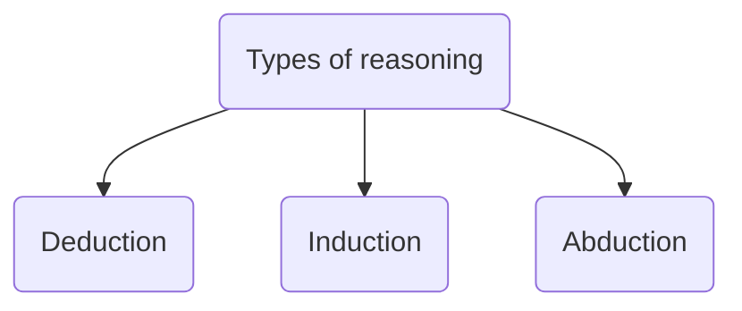
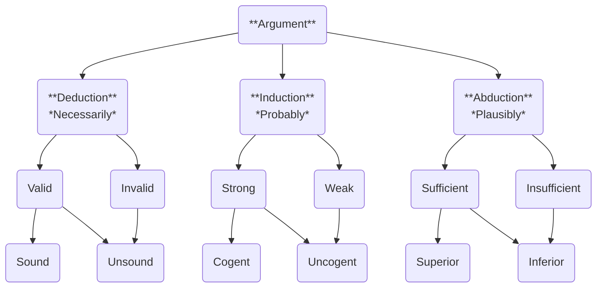
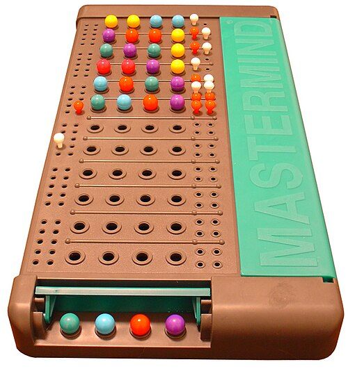

# Reasoning

This document is about reasoning and its methods: deduction, induction, and abduction.
https://www.merriam-webster.com/grammar/deduction-vs-induction-vs-abduction


The goal is to explore how reasoning can be a first class citizen in the implementation of Artificial Intelligence.

We can combine reasoning and argument philosophy<br>
to come up with a terminology structure for each reasoning type,<br>
their argument weight and quality of their evaluation results.

To get an intuition about reasoning we will stray away from abstract logic<br>
with propositions and truth values, but rather talk about:
- Facts, and relations between facts.
- Situations as sets of facts, and relations between situations

<svg width="300" height="60" fill="lightgray">
  <circle cx="20" cy="20" r="20" fill="#A00" opacity="0.8" />
  <text x="12" y="25" fill="white">S1</text>
  <circle cx="70" cy="20" r="20" fill="#080" opacity="0.8" />
  <text x="62" y="25" fill="white">S2</text>
  <circle cx="120" cy="20" r="20" fill="#00F" opacity="0.8" />
  <text x="112" y="25" fill="white">S3</text>

  <circle cx="15" cy="30" r="2" fill="white" />
  <circle cx="20" cy="10" r="2" fill="white" />
  <circle cx="25" cy="28" r="2" fill="white" />

  <circle cx="55" cy="20" r="2" fill="white" />
  <circle cx="70" cy="10" r="2" fill="white" />
  <circle cx="75" cy="28" r="2" fill="white" />

  <circle cx="105" cy="20" r="2" fill="white" />
  <circle cx="120" cy="10" r="2" fill="white" />
  <circle cx="115" cy="28" r="2" fill="white" />
</svg>

Sticking with the situational analogy makes it easier to understand<br>
how an automated reasoning algorithm can be implemented.


## Deduction
Deduction is the reasoning from one or more premises to reach a logical conclusion.<br>
https://www.engati.ai/glossary/logical-deduction

Rephrased in terms of situations;

```
If there exist a logical necessity that guaranties that
- any situation that satisfies some primary facts (premises)
- those situations will also satisfy some secondary facts (conclusions)

Then the deductive reasoning will be to
- search all situations those that satisfy the premises,
- all situations found will also satisfy the conclusions.
```

In the real world, no claim can be made by absolute certainty.
Tautologies can only be `assumed` from repeated observations and are weak.
In the real world, logical necessity is substituted for the Bayesian theorem.
The Bayesian evaluation must accumulate statistical data to build up some 'deductive' validity.

For AI to achieve reasoning, it need to be able to emulate deduction at some level.

**Notes**
Logical necessity is composed from a conjunction of premises and a disjunction of conclusions.


## Induction
## Abduction
Abductive reasoning is a form of logical inference that seeks<br>
the simplest and most likely conclusion<br>
from a set of observations.

**Example**<br>
A Mastermind player uses abduction to infer `the secret pegs colors`
from summaries of guess-discrepancies, provided by the
smaller `rating pegs`.


 

xxx

 <svg width="400" height="400">
  <circle cx="150" cy="50" r="50" fill="#A00" opacity="0.8" />
  <circle cx="120" cy="100" r="50" fill="#080" opacity="0.8" />
  <circle cx="180" cy="100" r="50" fill="#00F" opacity="0.8" />
</svg>


